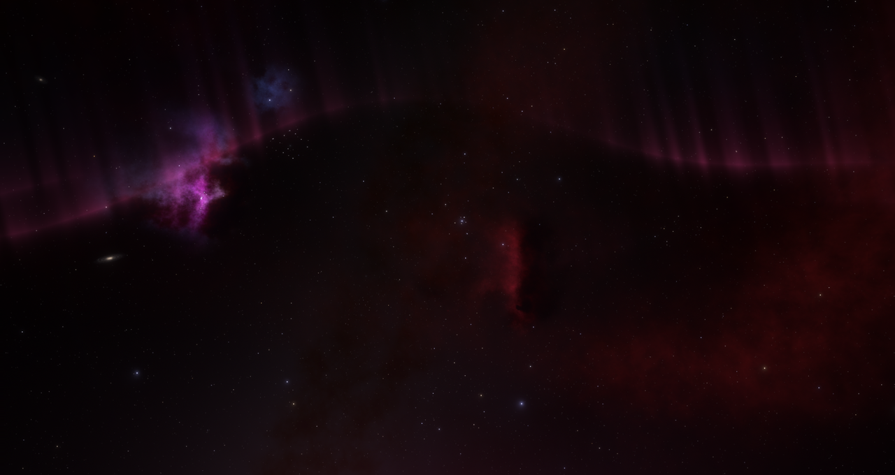

# Aurora

An audio-reactive aurora wallpaper for Wayland, built on [Quickshell](https://quickshell.org).

https://github.com/user-attachments/assets/e4768de2-8510-4474-8ba0-595d79bf5bbe



## What it does

- **Auroras:** curving ribbons with rays rising from them
  - mids make them brighter, bass makes them taller
  - the waves surge on each beat, then ease off
  - treble adds a subtle shimmer to the rays
- **Ripple:** the wallpaper slowly warps, harder on bass
- **Bottom glow:** a light rising from the bottom centre on bass
- **CPU load** speeds everything up a little
- **Colours** follow your theme (DankMaterialShell or pywal), or set your own
- **Wallpaper tint** (optional): gradient-maps the wallpaper onto your palette on the GPU, so it recolours live when the theme changes
- **Pauses when covered** (Hyprland): stops drawing while tiled or full-screen windows cover the workspace. Floating windows don't count.

## Requirements

- [Quickshell](https://quickshell.org) (tested with 0.3.1)
- [cava](https://github.com/karlstav/cava), with PipeWire
- A compositor with wlr-layer-shell: Hyprland, Sway, niri, KDE Plasma, river and others. **GNOME is not supported.**
- Linux (CPU load is read from `/proc/stat`)

On Arch: `pacman -S quickshell cava`

## Install

```sh
git clone https://github.com/ChickenSplash/aurora.git
cd aurora
./install.sh
```

This:

- symlinks the repo to `~/.config/quickshell/aurora`
- copies `config.example.json` to `~/.config/aurora/config.json` (if it doesn't exist yet)
- installs and starts `aurora.service` (a systemd user service tied to your graphical session)

Uninstall with `./install.sh --uninstall`. Your config is left in place.

Without systemd, run `qs -c aurora` from your compositor's autostart instead.

## Configuration

`~/.config/aurora/config.json`. Changes apply live.

| Key | Values | Default |
|---|---|---|
| `wallpaper` | `"auto"` / `"dms"` to follow DankMaterialShell, or an image path (`~` works) | `"auto"` |
| `colours` | `"auto"` (DMS, then pywal), `"dms"`, `"pywal"`, or three hex colours like `["#ff4fa3", "#7c4dff", "#40c4ff"]` | `"auto"` |
| `tint` | recolour the wallpaper through four palette colours (dark to light) | `false` |
| `tintGamma` | gamma applied to brightness before tinting (higher is brighter) | `1.6` |
| `tintColours` | optional four hex colours to override the tint ramp | not set |
| `pauseWhenCovered` | stop drawing behind tiled windows (Hyprland only) | `true` |
| `fps` | frame rate while sound is playing | `30` |
| `idleFps` | frame rate when silent | `12` |

The tint ramp comes from the colour source: DMS `background`, `primary_container`, `primary`, `on_primary_container`; pywal background, a mid tone, `color4` and foreground; or, with fixed colours, a dark-to-light ramp built from the first one. It uses HSB brightness (the brightest channel), so saturated detail in the image survives. Point `wallpaper` at the untinted original.

Without DankMaterialShell, set `wallpaper` to an image path. Aurora then draws the wallpaper itself, so you don't need another wallpaper tool.

## Tuning the effect

The numbers behind the look are in the code. Restart with `systemctl --user restart aurora` after changing them.

| What | Where | Default |
|---|---|---|
| How much louder than average counts as a beat | `shell.qml`, `bassAvg * 1.15 + 0.04` | 1.15 |
| Beat surge strength | `shell.qml`, `pulse * 8.0` | 8.0 |
| How fast the surge fades (higher is snappier) | `shell.qml`, `Math.exp(-dt * 5)` | 5 |
| Wave speed between beats | `shell.qml`, `0.4 + root.load...` | 0.4 |
| Ray shimmer strength | `aurora.frag`, `* 0.25 *` | 0.25 |
| Ray shimmer speed | `shell.qml`, `treble * 4.0` | 4.0 |

After editing a shader, rebuild its compiled `.qsb` (needs `qt6-shadertools`):

```sh
/usr/lib/qt6/bin/qsb --qt6 -o aurora.frag.qsb aurora.frag
/usr/lib/qt6/bin/qsb --qt6 -o tint.frag.qsb tint.frag
```

To see the effect without music, run `AURORA_DEBUG=1 qs -c aurora` (fakes loud mids).

## Notes

- **Stacking with another wallpaper tool:** Aurora needs to sit above it, and at login the other tool can win the race and cover it. Aurora draws the wallpaper itself (tinted or not), so the simplest fix is to turn the other one off. With DankMaterialShell, set `"screenPreferences": {"wallpaper": []}` in `~/.config/DankMaterialShell/settings.json`: DMS still supplies the image path and colours.
- **GPU cost:** with sound on one 1440p monitor, roughly 20 W extra on an RTX 3080. Lower `fps` to reduce it.
- **Audio source:** `cava.conf` reads PipeWire's default output. Change `method` to `pulse` if you use PulseAudio.

## Licence

MIT
